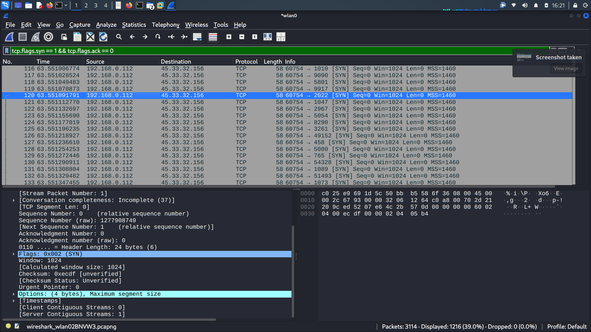

# Nmap Port Scan Analysis

## Objective
Detect and analyze a TCP SYN port scan using Wireshark display filters[cite: 4].

## Command Executed
`nmap -sS scanme.nmap.org`

## Traffic Observations (Wireshark)
- **Source IP:** `192.168.0.112`
- **Destination IP:** `45.33.32.156`
- **Display Filter Used:** `tcp.flags.syn == 1 && tcp.flags.ack == 0`
- **Behavior:** A large number of TCP packets with the `SYN` flag set were generated in quick succession targeting multiple destination ports from a single source port (`60754`).
- **Conclusion:** Indicates a SYN / Half-Open port scan.

## Evidence Screenshot

